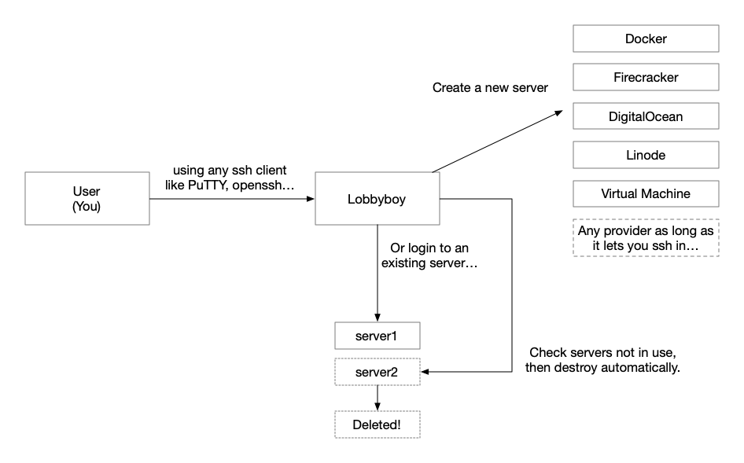
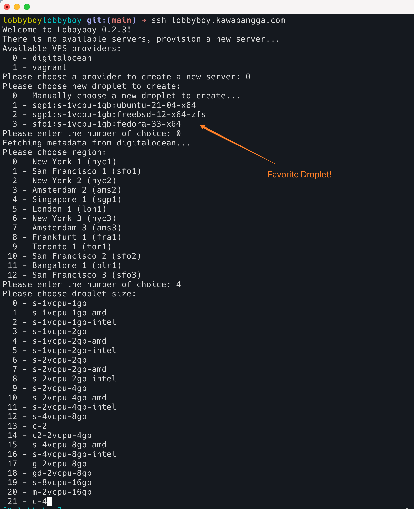

# Lobbyboy

> What is a lobby boy? A lobby boy is completely invisible, yet always in sight.
> A lobby boy remembers what people hate. A lobby boy anticipates the client's
> needs before the needs are needed. A lobby boy is, above all, discreet to a
> fault.
>
> <p align='right'>--The Grand Budapest Hotel</p>

[](https://results.pre-commit.ci/latest/github/lobbyboy-ssh/lobbyboy/main)
[](https://github.com/lobbyboy-ssh/lobbyboy/actions/workflows/unittest.yaml)

<a href="https://badge.fury.io/py/lobbyboy"></a>

[](https://codecov.io/gh/lobbyboy-ssh/lobbyboy)

**This project is still under testing, it worked but may have bugs.**

<!-- vim-markdown-toc GFM -->

* [What is lobbyboy?](#what-is-lobbyboy)
* [Key Features](#key-features)
* [Installation](#installation)
* [Run server](#run-server)
  * [Generate a key pair for authentication](#generate-a-key-pair-for-authentication)
* [Deployment](#deployment)
  * [Systemd Example](#systemd-example)
  * [Run in Docker](#run-in-docker)
* [Providers](#providers)
  * [Builtin Providers](#builtin-providers)
    * [Vagrant Provider](#vagrant-provider)
    * [Footloose Provider](#footloose-provider)
    * [DigitalOcean Provider](#digitalocean-provider)
    * [Linode Provider](#linode-provider)
    * [Ignite(Firecracker) Provider](#ignitefirecracker-provider)
    * [Multipass Provider](#multipass-provider)
  * [Write Your Own Providers](#write-your-own-providers)
  * [Publish Your Own Providers](#publish-your-own-providers)
* [FAQ](#faq)
* [I Want to Know More!](#i-want-to-know-more)

<!-- vim-markdown-toc -->

## What is lobbyboy?

Well, lobbyboy is a ssh server. Yes, like `sshd`. But instead of spawn a new
shell on the server like sshd, when you ssh to lobbyboy, lobbyboy will create a
new server(VPS) from available providers(meaning to say, DigitalOcean, AWS, GCP,
Vultr, etc), then redirect you to the newly created servers. Of course, if
lobbyboy finds any servers available already, he will just ask if you want to
enter the existing server, or still want to create a new one.



## Key Features

- talks in SSH2 protocol, no need to install any software of configs for
  client-side, just ssh to lobbyboy!
- extendable provider: just implement 3 methods, then lobbyboy can work with any
  provider!
- destroy the server when you no longer needed.
- manage ssh keys for you

## Installation

Install libkrb5-dev first, this is a dependency for gssapi support.

```bash
apt install libkrb5-dev
```

Install via pip:

```bash
pip install lobbyboy
```

## Run server

First, generate a config file:

```bash
lobbyboy-config-example > config.toml
# Edit your config before running!
```

Run the server with:

```bash
lobbyboy-server -c config.toml
```

You can ssh to Lobbyboy now, if you keep the default user `Gustave` in default
config. You can ssh to Lobbyboy via:

```bash
ssh Gustave@127.0.0.1 -p 12200
# Enter the default password "Fiennes"(without quotes)
Welcome to Lobbyboy 0.2.2!
There are 1 available servers:
  0 - Create a new server...
  1 - Enter vagrant lobbyboy-41 127.0.0.1 (0 active sessions)
Please input your choice (number):
```

You may want to change the password in `config.toml` or use a public key for
authentication. The latter is recommended in a production environment.

### Generate a key pair for authentication

Generate a key pair:

```bash
ssh-keygen -f lobbyboy_key
```

Add the content of `lobbyboy_key.pub` to the end of `authorized_keys` under
`[user.Gustave]` table. Now you can ssh to the lobbyboy server via:

```bash
ssh Gustave@127.0.0.1 -i lobbyboy_key
```

## Deployment

Lobbyboy is supposed to be a server daemon, so you can manage it by
systemd/[supervisord](http://supervisord.org/) or put it into a docker.

### Systemd Example

```ini
[Unit]
Description=Lobbyboy Server

[Service]
User=me
Group=me
ExecStart=/path/to/lobbyboy-server -c /path/to/lobbyboy/config.toml
Restart=on-failure
WorkingDirectory=/path/to/lobbyboy/

[Install]
WantedBy=multi-user.target
```

### Run in Docker

```bash
# Generate a config file
docker run --rm ghcr.io/lobbyboy-ssh/lobbyboy lobbyboy-config-example > lobbyboy_config.toml
# Run the docker container
docker run -v `pwd`/lobbyboy_config.toml:/app/config.toml -p "12200:12200" -d ghcr.io/lobbyboy-ssh/lobbyboy
```

The lobbyboy server should be active on 12200 port and you can connect to it
with

```
ssh Gustave@127.0.0.1 -p 12200
```

The default password for user `Gustave` is `Fiennes`. **Please change it when
you deployed it into production, and consider use ssh key to auth instead of
password.**

## Providers

// TBD

### Builtin Providers

Lobbyboy current support multiple Providers:

- Vagrant (Need vagrant and virtualbox to be installed)
- Footlosse, in another words, containers (Need
  [footloose](https://github.com/weaveworks/footloose) and docker to be
  installed)
- DigitalOcean
- Linode
- [Ignite](https://github.com/weaveworks/ignite) (Runs Firecracker VM)
- [multipass](https://multipass.run)

Different Providers support different configs, please see the
[example config](https://github.com/laixintao/lobbyboy/blob/main/lobbyboy/conf/lobbyboy_config.toml)
for more detail.

#### Vagrant Provider

Vagrant Provider won't cost you any money, [vagrant](https://www.vagrantup.com/)
is a software runs on your computer along with virtual machine providers,
vagrant can provision and control your VM.

This provider can help you to create a new Vagrant instance when you login to
Lobbyboy, and destroy the server when you no longer use it.

Supported Features:

- Create new Vagrant instances
- You can configure your VM via `vagrantfile` config (see the config
  [example](./lobbyboy/conf/lobbyboy_config.toml)).

#### Footloose Provider

[footloose](https://github.com/weaveworks/footloose) can make your docker
containers(or Firecracker with [ignite](https://github.com/weaveworks/ignite))
act like virtual machine, so you can ssh to it.

Supported feature:

- Configurable base image
- Create a docker container and redirect you in

#### DigitalOcean Provider

This Provider will create
[Droplet](https://docs.digitalocean.com/products/droplets/) from DigitalOcean.

Supported Features:

- Create a new ssh key every time create a droplet.
- Ask user to input region/droplet size/image when creating.
- User can save favorite Droplet region/size/image in configs to quick create.
- Destroy droplet when it is not in use.

#### Linode Provider

This Provider will create [Node](https://www.linode.com/docs/products/compute/)
from Linode.

Supported Features:

- Create a new ssh key every time create a droplet.
- Ask user to input region/node type/image when creating.
- User can save favorite node region/type/image in configs to quick create.
- Destroy node when it is not in use.

Please see
[configs](https://github.com/laixintao/lobbyboy/blob/main/lobbyboy/conf/lobbyboy_config.toml)
to check available options.

#### Ignite(Firecracker) Provider

Supported Features:

- Create a new Firecracker virtual machine
- Destroy node when it is not in use.

#### Multipass Provider

Supported Features:

- Create a new virtual machine
- Destroy node when it is not in use.



### Write Your Own Providers

Providers are VPS vendors, by writing new providers, lobbyboy can work with any
VPS vendors.

To make a new Provider work, you need to extend base class
`lobbyboy.provider.BaseProvider``, implement 2 methods:

```python
    def is_available(self) -> bool:
        """
        Override this method to check for requirements of this provider

        Returns:
            bool: True if this provider is available, False to disable it
        """
        return True

    def create_server(self, channel: Channel) -> LBServerMeta:
        """
        Args:
            channel: paramiko channel

        Returns:
            LBServerMeta: server meta info
        """
        ...


    def destroy_server(self, meta: LBServerMeta, channel: Channel = None) -> bool:
        """
        Args:
            meta: LBServerMeta, we use this to locate one server then destroy it.
            channel: Note that the channel can be None.
                     If called from server_killer, channel will be None.
                     if called when user logout from server, channel is active.

        Returns:
            bool: True if destroy successfully, False if not.
        """
        ...
```

Then add your Provider to your config file.

Those 3 configs are obligatory, as lobbyboy has to know when should he destroy
your spare servers. You can add more configs, and read them from
`self.provider_config` from code, just remember to add docs about it :)

```toml
[provider.<your provider name>]
load_module = "lobbyboy.contrib.provider.<your provider module name>::<Provider Class>"
min_life_to_live = "1h"
bill_time_unit = "1h"
```

### Publish Your Own Providers

// TBD

## FAQ

Q: Can I use lobbyboy as a proxy, like adding it to my `ProxyCommand` in ssh
config?

A: No. Lobbyboy works like a reverse proxy, meaning to say, for ssh client, it
just like a ssh server(sshd maybe), ssh client get a shell from lobbyboy, and
doesn't know if it is local shell or it is a nested shell which runs another
ssh. (but you know it, right? :D )

## I Want to Know More!

- [介绍 Lobbyboy 项目](https://www.kawabangga.com/posts/4576) (in Chinese)
